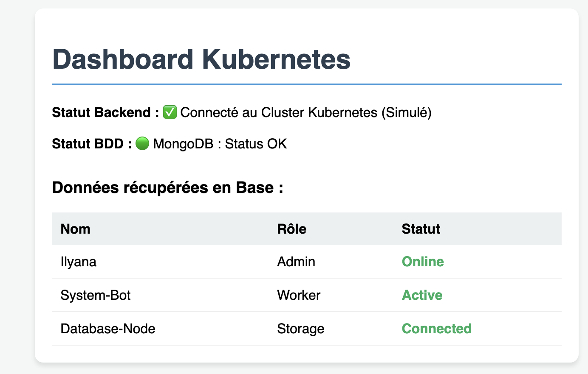
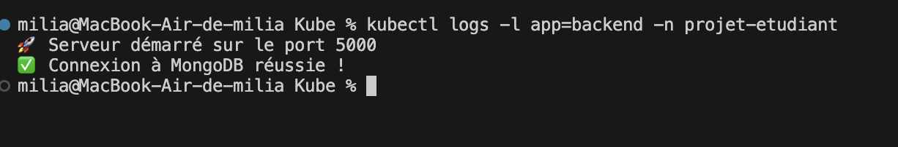
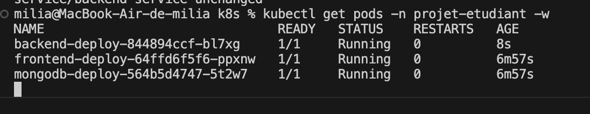

### Projet de Milia LAHOUAZI

Ce projet consiste en la mise en place d'une architecture microservices conteneurisée, déployée sur un cluster Kubernetes local via Minikube. L'application suit une stack MERN simplifiée (MongoDB, Express, React).

L'infrastructure est divisée en trois composants principaux isolés dans le namespace projet-etudiant :

Frontend : Application React servie par Nginx, gérant l'interface utilisateur.

Backend : API Node.js gérant la logique métier et la connexion à la base de données.

Database : Instance MongoDB pour la persistance des données.

1.  **01-config.yaml** (Namespace + Secret pour le mot de passe BDD).
2.  **02-database.yaml** (Deployment Mongo + Service ClusterIP).
3.  **03-backend.yaml** (Deployment Node.js avec image `ilyanagolmi/k8s-back:v1`).
4.  **04-frontend.yaml** (Deployment React avec image `ilyanagolmi/k8s-front:v1` + Service NodePort).
5.  **05-ingress.yaml** (Règles de routage pour `mon-projet.local`).

3. Choix Technologiques & Sécurité
Dockerisation : Chaque service possède son propre Dockerfile pour garantir la portabilité.

Secret Map : Les identifiants MongoDB ne sont pas codés en dur. Ils sont stockés dans un objet Secret Kubernetes (encodé en Base64), assurant la sécurité des données sensibles.

## Projet Cluster Kubernetes - Application MERN

Ce projet déploie une application complète (Front, Back, DB) sur Kubernetes.

1. La première phase a consisté à isoler les services Frontend (React) et Backend (Node.js/Express) via Docker.

2. Création des Dockerfiles : Rédaction de fichiers de configuration pour construire des images légères (basées sur Alpine Linux).

3. Registre Docker Hub : Les images ont été taguées et poussées sur le dépôt distant ilyanagolmi pour permettre au cluster Kubernetes de les récupérer (pull) lors du déploiement.

4. Gestion de l'Infrastructure (Manifests YAML)
L'orchestration a été réalisée via un manifest structuré, garantissant la portabilité et la répétabilité du déploiement.

Namespace & Isolation : Création du namespace projet-etudiant pour isoler les ressources du cluster.

Persistance et Sécurité : Utilisation d'un objet Secret pour la gestion des identifiants MongoDB. Les données sensibles sont encodées en Base64 et injectées dans les pods via des variables d'environnement.

5. Déploiements (Deployments) : Configuration des stratégies de réplication et de gestion du cycle de vie des pods pour assurer la haute disponibilité des services.

6. Architecture Réseau et Exposition
Services ClusterIP : Mise en place d'une communication interne privée entre le Backend et la base de données (port 27017).

Service NodePort : Exposition du Frontend sur le port statique 30001 du nœud Kubernetes.

Ingress Controller : Configuration d'un point d'entrée unique via le protocole HTTP. Le contrôleur NGINX gère le routage par nom d'hôte (mon-projet.local) et par chemin (path-based routing) vers les services correspondants.

7. Validation et Déploiement Local
Le déploiement a été finalisé sur un environnement Minikube (driver Docker).

Tunneling : Sur macOS, l'activation du tunnel Minikube a été nécessaire pour exposer l'adresse IP de l'Ingress au réseau local de l'hôte.

### Guide de Déploiement 
Pré-requis
Docker Desktop & Minikube installés.
L'application utilise des images Docker pré-construites et hébergées sur Docker Hub. Il n'est pas nécessaire de compiler le code source pour lancer le projet.

Images utilisées :

ilyanagolmi/k8s-front:v1

ilyanagolmi/k8s-back:v3

mongo:latest (image officielle)
Suivez les etapes: 
- kubectl apply -f .
- kubectl get pods -n projet-etudiant
- minikube service frontend-service -n projet-etudiant

